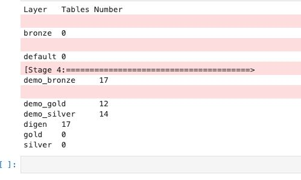

IMPORTANT ❗ ❗ ❗ Please remember to destroy all the resources after each work session. You can recreate infrastructure by creating new PR and merging it to master.


0. The goal of this phase is to create infrastructure, perform benchmarking/scalability tests of sample three-tier lakehouse solution and analyze the results using:
* [TPC-DI benchmark](https://www.tpc.org/tpcdi/)
* [dbt - data transformation tool](https://www.getdbt.com/)
* [GCP Composer - managed Apache Airflow](https://cloud.google.com/composer?hl=pl)
* [GCP Dataproc - managed Apache Spark](https://spark.apache.org/)
* [GCP Vertex AI Workbench - managed JupyterLab](https://cloud.google.com/vertex-ai-notebooks?hl=pl)

Worth to read:
* https://docs.getdbt.com/docs/introduction
* https://airflow.apache.org/docs/apache-airflow/stable/index.html
* https://spark.apache.org/docs/latest/api/python/index.html
* https://medium.com/snowflake/loading-the-tpc-di-benchmark-dataset-into-snowflake-96011e2c26cf
* https://www.databricks.com/blog/2023/04/14/how-we-performed-etl-one-billion-records-under-1-delta-live-tables.html

2. Authors:

   ***Enter your group nr***

   ***Link to forked repo***

3. Sync your repo with https://github.com/bdg-tbd/tbd-workshop-1.

4. Provision your infrastructure.

    a) setup Vertex AI Workbench `pyspark` kernel as described in point [8](https://github.com/bdg-tbd/tbd-workshop-1/tree/v1.0.32#project-setup) 

    b) upload [tpc-di-setup.ipynb](https://github.com/bdg-tbd/tbd-workshop-1/blob/v1.0.36/notebooks/tpc-di-setup.ipynb) to 
the running instance of your Vertex AI Workbench

5. In `tpc-di-setup.ipynb` modify cell under section ***Clone tbd-tpc-di repo***:

   a)first, fork https://github.com/mwiewior/tbd-tpc-di.git to your github organization.

   b)create new branch (e.g. 'notebook') in your fork of tbd-tpc-di and modify profiles.yaml by commenting following lines:
   ```  
        #"spark.driver.port": "30000"
        #"spark.blockManager.port": "30001"
        #"spark.driver.host": "10.11.0.5"  #FIXME: Result of the command (kubectl get nodes -o json |  jq -r '.items[0].status.addresses[0].address')
        #"spark.driver.bindAddress": "0.0.0.0"
   ```
   This lines are required to run dbt on airflow but have to be commented while running dbt in notebook.

   c)update git clone command to point to ***your fork***.

 


6. Access Vertex AI Workbench and run cell by cell notebook `tpc-di-setup.ipynb`.

    a) in the first cell of the notebook replace: `%env DATA_BUCKET=tbd-2023z-9910-data` with your data bucket.


   b) in the cell:
         ```%%bash
         mkdir -p git && cd git
         git clone https://github.com/mwiewior/tbd-tpc-di.git
         cd tbd-tpc-di
         git pull
         ```
      replace repo with your fork. Next checkout to 'notebook' branch.
   
    c) after running first cells your fork of `tbd-tpc-di` repository will be cloned into Vertex AI  enviroment (see git folder).

    d) take a look on `git/tbd-tpc-di/profiles.yaml`. This file includes Spark parameters that can be changed if you need to increase the number of executors and
  ```
   server_side_parameters:
       "spark.driver.memory": "2g"
       "spark.executor.memory": "4g"
       "spark.executor.instances": "2"
       "spark.hadoop.hive.metastore.warehouse.dir": "hdfs:///user/hive/warehouse/"
  ```


7. Explore files created by generator and describe them, including format, content, total size.
    
   Zostały wygenerowane foldery "Batch1", "Batch2", "Batch3" zawierające dane w formatach tekstowych (rozszerzenia .txt, .csv oraz brak rozszerzenia).
   "Batch1" jest największy z nich (9.4G), "Batch2" i "Batch3" mają ten sam rozmiar (112M).
   
   Pliki w formatach .txt oraz bez formatu zawierają dane z tablic baz danych i każdemu z nich odpowiada plik z formatem .csv
   który ma nazwę [nazwa oryginalnego pliku]_audit.csv zawierające informacje o kolumnach tych tablic.

   Oprócz tego na poziomie folderów "Batch[1-3]" zostały wygenerowane pliki:
   * Batch[1-3]_audit.csv - zawieraja początkową i końcową daty dla danych z odpowiadającego podfolderu
   * Generator_audit.csv - zawiera wartości atrybutów generatora
   * digen_report.txt - krótki raport generacji, zawiera datę i czas rozpoczęcia i zakończenia procesu generacji, liczność wygenerowanych
     danych w każdym podfolderze, wykorzystane opcje komady wywołania, etc.

8. Analyze tpcdi.py. What happened in the loading stage?

   W pliku `tpcdi.py` wykonywane są następujące kroki:

   1. **Inicjalizacja sesji i bazy danych**:
      - Tworzenie nowej sesji.
      - Tworzenie bazy danych, która będzie zawierała dane do dalszego przetwarzania.

      2. **Definiowanie schematu tabeli**:
         - Dla każdego przetwarzanego pliku definiowany jest odpowiedni schemat tabeli.

      3. **Ładowanie danych**:
         - Używanie zdefiniowanego schematu tabeli do załadowania danych z plików (txt i bez rozszerzenia) do odpowiednich tabel w bazie danych.

      4. **Przetwarzanie danych**:
         - Wykonywanie zapytań SQL na załadowanych tabelach w celu przetworzenia danych i stworzenia tabel wynikowych.

      5. **Zapisywanie wyników**:
         - Zapis tabel wynikowych do plików.

9. Using SparkSQL answer: how many table were created in each layer?

   Kod:
   ```
    from pyspark.sql import SparkSession

    spark = SparkSession.builder\
        .appName("TBD-TPC-DI-setup") \
        .enableHiveSupport() \
        .getOrCreate()
    
    layers = sorted(
        d.namespace
        for d in spark.sql('show databases').collect()
    )
    
    print("Layer\tTables Number")
    for layer in layers:
        spark.sql(f'use {layer}')
        tables_number = spark.sql('show tables').count()
        print(f'{layer}\t{tables_number}')
   ```
   Wynik:

   
    

10. Add some 3 more [dbt tests](https://docs.getdbt.com/docs/build/tests) and explain what you are testing. ***Add new tests to your repository.***

    1. Weryfikacja, czy wszystkie transakcje w tabeli fact_trade mają przypisane istniejące ID brokera z tabeli dim_broker:
       ```
       select *
       from {{ ref('fact_trade') }}
       where broker_id not in (select broker_id from {{ ref('dim_broker') }})
       ```
    2. Sprawdzenie, czy kolumna balance w tabeli fact_cash_balances zawiera tylko dodatnie wartości:
       ```
       select *
       from {{ ref('fact_cash_balances') }}
       where balance <= 0
       ```
    3. Testowanie, czy wszystkie transakcje w tabeli fact_cash_transactions mają przypisane istniejące ID konta z tabeli dim_account:
       ```
       select *
       from {{ ref('fact_cash_transactions') }}
       where account_id not in (select account_id from {{ ref('dim_account') }})
       ```

11. In main.tf update
   ```
   dbt_git_repo            = "https://github.com/mwiewior/tbd-tpc-di.git"
   dbt_git_repo_branch     = "main"
   ```
   so dbt_git_repo points to your fork of tbd-tpc-di. 

12. Redeploy infrastructure and check if the DAG finished with no errors:


